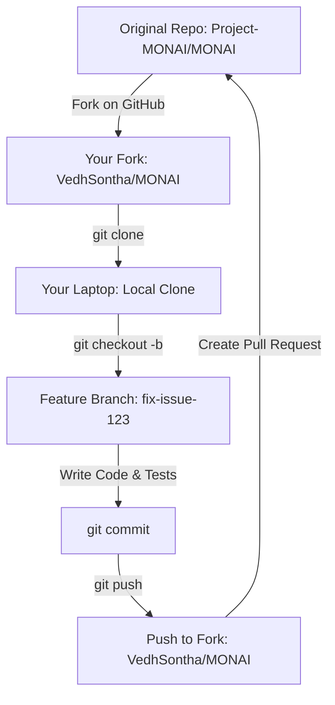

# Open Source Contribution Guide: MONAI & ML Ecosystem

This guide serves as a structured blueprint to help you make your first open-source contributions to Python-based Machine Learning and Computer Vision libraries. You can use this file in a new chat session to guide your AI assistant through the contribution process step-by-step.

---

## 🚀 Why Open Source is Worth It
* **Industry Credibility:** A merged Pull Request (PR) in a major framework (like MONAI, PyTorch, or torchvision) proves to recruiters and reviewers (like the Amazon ML Summer School panel) that you can work within professional, production-grade software pipelines.
* **Collaboration Skills:** You learn Git best practices, code reviews, and coding style guidelines (such as PEP8, black formatting, type-hinting).
* **Networking:** You engage directly with core maintainers and domain experts.

---

## 🛠️ The Git Contribution Workflow

To contribute, you will follow a standard forks-and-branches model:



### 1. Link to the Original Repo (Upstream)
To keep your local repository updated with changes made by other developers, you must track the original repository:
```bash
# Clone your fork
git clone https://github.com/VedhSontha/MONAI.git
cd MONAI

# Add the original repository as 'upstream'
git remote add upstream https://github.com/Project-MONAI/MONAI.git

# Verify remotes
git remote -v
```

### 2. Keep Your Fork Synced
Before making any changes, pull the latest changes from the original repository:
```bash
git checkout dev # or main
git fetch upstream
git merge upstream/dev
git push origin dev
```

### 3. Develop Your Fix on a Branch
Never write code directly on the `main` or `dev` branch. Always use a dedicated branch:
```bash
git checkout -b fix-transform-padding
```

---

## 🧠 Core Target: MONAI (Medical Open Network for AI)
Since you are working on image segmentation and brain tumor classification, MONAI is the perfect PyTorch-native project to target.

* **GitHub Repository:** [Project-MONAI/MONAI](https://github.com/Project-MONAI/MONAI)
* **Good First Issues Link:** [MONAI Good First Issues Tracker](https://github.com/Project-MONAI/MONAI/issues?q=is%3Aissue+is%3Aopen+label%3A%22good+first+issue%22)

### Common MONAI Entry Points:
1. **`monai/transforms/`**: Adding parameters or validating bounds for image augmentations (cropping, flipping, normalization).
2. **`monai/networks/`**: Formatting layers, fixing docstrings, or adding features to network architectures.
3. **`tests/`**: Writing additional unit tests to increase coverage for existing components.

---

## 📋 Steps to Run in Your Next Chat Session

When you open a new chat session to start your contribution, paste the following prompt:

> *"Hey! I want to make an open-source contribution to the MONAI repository. Here is my plan:
> 1. We will search for a `good first issue` on MONAI's GitHub Issues tab.
> 2. Once chosen, we will fork the repo, clone it locally, and configure the `upstream` remote.
> 3. We will write the fix, write unit tests, run the test suite locally, and push to my branch.
> 4. We will prepare the Pull Request.
> 
> Let's start by looking at candidate issues or cloning the repository!"*
